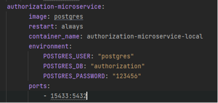
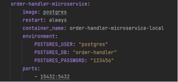
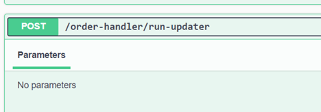

## Домашнее задание №4

#### Запуск:

Для запуска в терминале необходимо прописать:

```
docker compose up -d
```

#### Описание: 

Релизованно два микросервиса [AuthorizationMicroservice.csproj](AuthorizationMicroservice%2FAuthorizationMicroservice.csproj) и [OrderHandlerMicroservice.csproj](OrderHandlerMicroservice%2FOrderHandlerMicroservice.csproj)

Микросервисы имеют общую структору:

**Controller –> service –> repository –> database**

Service – класс, выполняющий основную бизнеслогику приложения.

Repository – классы, взаимодействующие с БД.

У каждого микросервиса собственная БД.

Помимо этого имеется промежуточное ПО ошибок (ErrorMiddleware), которое перехватывает ошибки сервера, для сокрытия его уязвимостей (Например, если мы выключим сервер).

**Микросервис авторизации:**



В рамках работы над ним реализованы handle:<br>
•	Регистрация пользователя;<br>
•	Вход пользователя в систему;<br>
•	Выдача информации о пользователе по токену.

`Регистрация пользователя`<br>
Вводится информация о пользователе. Проверяется валидность введенных данных. Выводятся различные коды ответов.

`Вход пользователя в систему`<br>
Вводится информация для входа. Проверяется валидность введенных данных. Выводятся различные коды ответов. Возвращает Jwt token.

В дефолтном swagger отсутствует реализация совместного swagger ui для двух микросервисом, поэтому авторизация выполняется условно – там, где требуется подтверждение роли пользователя нужно предъявить token.

**Микросервис управления заказами**



В рамках работы над ним реализованы handle:<br>
•	Управление заказами;<br>
•	Управление блюдами;<br>
•	Предоставление информации о меню.

`Управление заказами`

Пользователь при помощи jwt токена может создать заказ. Вводится информация о заказе. Проверяется валидность введенных данных. Выводятся различные коды ответов.

Чтобы включить обработчик заказов нужно прокликать handle run-updater.



После этого запускается поток, который раз в некоторое время берет заказ в статусе «В ожидании» и либо отменяет его, либо выполняет.

`Управление блюдами`

Пользователям со статусом manager доступно управление блюдами. Вводится информация о блюдах. Проверяется валидность введенных данных. Выводятся различные коды ответов.

`Предоставление меню`

Проверяется, что на складе положительное количество блюда. Если это так, то выводится информация о нем.

`Про взамодействие микросервисов`

По хорошему нужно было бы подключить kafka или что-нибудь еще и передавать информацию через нее, но ввиду условности происходящего взаимодействие работает так: чтобы проверить пользователя микросервис управления заказами идет в базу данных микросервиса авторизации и выполняет поставленную перед ним задачу. 


